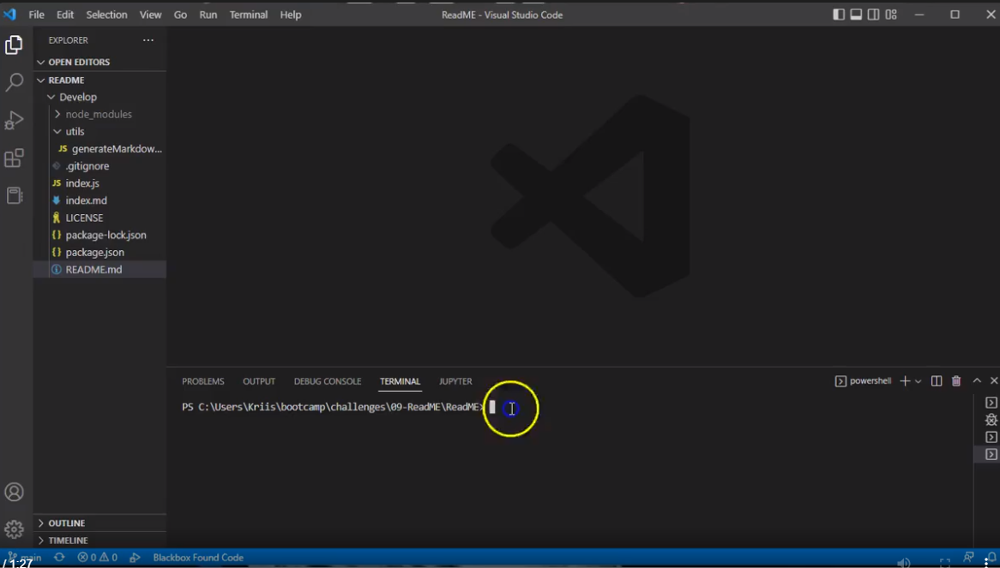

#Professional README Generator

## Description

-  My motivation for this project was to make a README file while in the node environment.
- I built this project so that I may be able to further understand this project and use it for other items such as posting a resume online. I will be trying this as a personal project.
- This solves the problem of manually making a README file and answering questions so that the README file could be executed with your answers.
- I learned how to resolve the issues I had with this project and how to use the screenreader to record the video for this assignment.

## Table of Contents (Optional)

- [Installation](#installation)
- [Usage](#usage)
- [Credits](#credits)
- [License](#license)

## Installation

The only requirment for this project is to have inquirer 8.2.4 installed for your NODE environment.

## Usage

The following screenshot will take you to the video of how the README file is made via the Node environment.

![Screenshot of video snippet of README file being made via NODE environment]

## Credits

I had help from a school tutor for fixing the error I had to finalize this project.

## License

MIT

## Badges

![License(https://img.shields.io/badge/license-MIT-blue)

